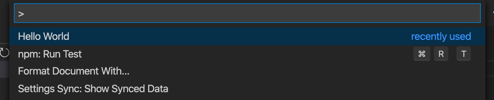

# VS Code Extension Quickstart docs

    

## Menu

- [How does the extension work?](how-it-works.md)
- [Installation](installation.md)
- [Usage](usage.md)
- [Deploy](deploy.md)
- [Development](development.md)
- [Start fresh](start-fresh.md)

## Preview

1. Run from the VSC command prompt
    
2. Pop-up notification
    

## What is this project?

- It started as auto-generated simple _Hello World_ VS Code extension
- I added preview screenshots, thorough docs and links to external resources
- The repo is available as a _template_ so you can easily get your own copy

## About
> How this extension was generated and what you can do with it

This project covers the outline of a basic VS Code extension which can be installed and run locally.

This template project was generated using the `yeoman` NPM package and the "default" option, as covered in the [Start fresh](start-fresh.md) doc.

This extension is just a simple "Hello world" application. To try it out locally, follow the [Install](installation.md) doc and then [Start the extension](development.md#start-the-extension) in sandboxed debug mode (it won't be installed globally).

This project will not be developed further. It will mainly serve as a reference for existing projects. Or possibly as a template for new projects (with the difference that values have to be replaced manually rather than setup using a CLI).

See the [Resources][] page on my Dev Cheatsheets site for links on getting started with extensions or for references on how to export and publish.

[Resources]: https://michaelcurrin.github.io/dev-cheatsheets/cheatsheets/vscode-extensions/resources.html
