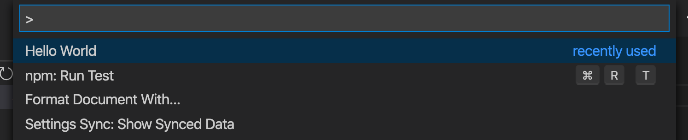
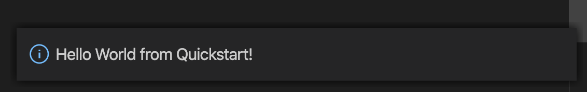

# Usage
> How to build, setup and use a dev version of this extension

## Install

If you haven't already, follow the [Installation](installation.md) steps to get your Node.js dependencies setup.

## Start the extension in debug mode

Follow [Start the extension](development.md#start-the-extension) steps to get the extension running in a sandboxed environment. 

You can skip the lint and test steps beforehand if you aren't changing any code.

## Use the extension

1. Open the command palette - click _View_ from the menu then _Command palette..._ or press <kbd>SHIFT</kbd>+<kbd>CMD</kbd>+<kbd>P</kbd> on macOS.
1. Search for "Hello World".
    
1. Click it or press <kbd>Enter</kbd> after you select it.
1. You'll see an info box appear in the bottom right.
    

That's all this extension does.

What next? Go through these [Resources](https://michaelcurrin.github.io/dev-cheatsheets/cheatsheets/vscode-extensions/resources.html) to learn more about VS Code or get inspiration from sample projects and real extensions.
